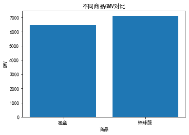
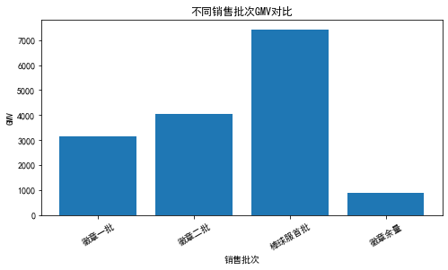
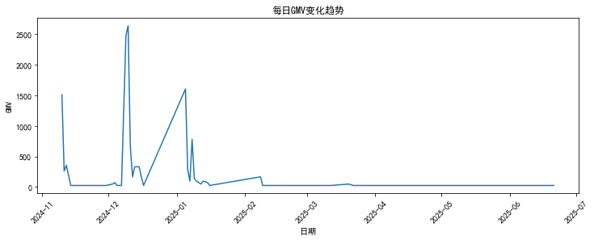
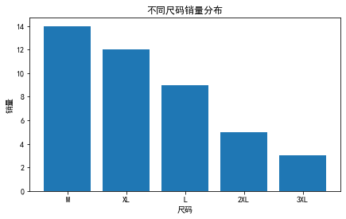
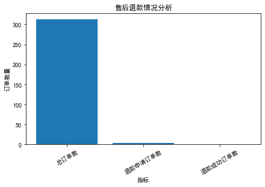

# 消费品电商销售数据分析项目

## 项目介绍

本项目基于消费品电商订单数据，使用 Python 对销售数据进行清洗、探索性分析（EDA）和可视化分析。

通过分析商品销售表现、销售批次、时间趋势、商品规格偏好以及售后情况，挖掘消费者购买行为和商品运营表现，为商品运营、库存管理和销售决策提供数据支持。

---

## 技术栈

- Python
- Pandas
- Matplotlib
- Jupyter Notebook
- Excel

---

## 项目流程

### 1. 数据清洗

主要处理：

- 日期字段格式转换
- 数据类型处理
- 重复值与异常值检查
- 构建 GMV（成交金额）指标

完成原始订单数据向标准化分析数据的转换。

---

### 2. 核心指标分析

计算主要业务指标：

| 指标 | 数值 |
| --- | --- |
| GMV | 13561.4 |
| 订单数 | 312 |
| 销量 | 317 |
| 平均客单价 | 43.47 |

---

### 3. 商品销售分析

对不同商品进行销售表现分析：

- 对比不同商品的 GMV、销量和订单贡献
- 分析高销量商品与高收入商品之间的差异

主要发现：

- 徽章贡献主要销量，占整体销量较高比例
- 棒球服由于客单价较高，对 GMV 贡献较大

---

### 4. 销售批次分析

针对不同销售批次进行分析：

- 对比各批次 GMV 和销量表现
- 分析不同销售阶段的销售贡献

主要发现：

- 不同批次销售表现存在差异
- 棒球服首批带来较高销售收入

---

### 5. 时间趋势分析

按日期/月度分析销售变化：

- 观察销售高峰时期
- 分析销售节奏变化

主要用于辅助判断运营活动效果。

---

### 6. 商品规格分析

针对棒球服商品型号进行分析：

- 统计不同尺码销量
- 识别消费者规格偏好

为后续库存规划提供参考。

---

### 7. 售后分析

分析订单退款情况：

- 退款申请订单数
- 成功退款订单数
- 实际退款率

主要发现：

- 总订单312笔，仅3笔发起退款申请
- 成功退款1笔，实际退款率0.32%
- 整体售后情况较稳定

---

## 可视化展示

### 商品 GMV 分析

### 销售批次 GMV 分析

### 销售趋势分析

### 尺码销量分析

### 售后分析

---

## 项目结构
consumer-commerce-analysis
│
├── notebooks
│   ├── 01_data_cleaning.ipynb
│   ├── 02_eda.ipynb
│   └── 03_visualization.ipynb
│
├── images
│   ├── product_gmv.png
│   ├── batch_gmv.png
│   ├── daily_gmv_trend.png
│   ├── size_analysis.png
│   └── refund_analysis.png
│
├── README.md
└── requirements.txt
---

## 项目总结

本项目完成了从原始订单数据清洗、业务指标构建、探索性分析到可视化展示的完整数据分析流程。

通过对商品、销售批次、时间趋势、消费者规格偏好和售后情况的分析，帮助理解消费品电商业务中的销售表现和用户需求特点。
